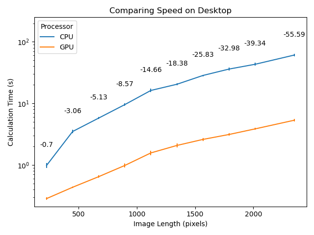

+++
title = 'Cellpose - GPU vs CPU'
date = 2024-08-31T19:23:26-07:00
draft = true
+++

## Cellpose: GPU vs CPU.
Cellpose is a valuable tool in the arsenal of any bioimaging scientist. It allows for fast, accurate, and general segmentation of a variety of biological images. Cellpose uses the UNet Machine Learning model, trained on a corpus of biological images, to determine the location and shape of cells.

However, image processing tasks can become quite long and computationally intensive, especially when tasks are processed serially on the CPU. In order to accelerate this process, it becomes worthwhile to leverage the GPU to accelerate processing. 

## GPU vs CPU - Speed Differences
Recently, Cellpose was enabled to on both the Metal (Apple) and CUDA (NVIDIA) graphical processing units. It's worthwhile to explore how much this speed-up means in terms of real-world performance.

### Mac - M1 Air

### Linux - NVIDIA RTX 4070
(Processor here is Intel i7-8086K, 5GHz)

## Processing details:
All processing is done with the following setup:
- Cellpose v3.0.11

For these tests, I'll be using 5 iterations per test, and recording the mean. Images increase in length and width in size, from the smallest (224px\*224px), to the full image (2560px\*2160px). The image comes from the 2022 NeurIPS challenge. This one is Cell\_00505.tif from the training images.

*Image from [2022 NeurIPS](https://zenodo.org/records/10719375) challenge, licensed CC-BY-ND*
