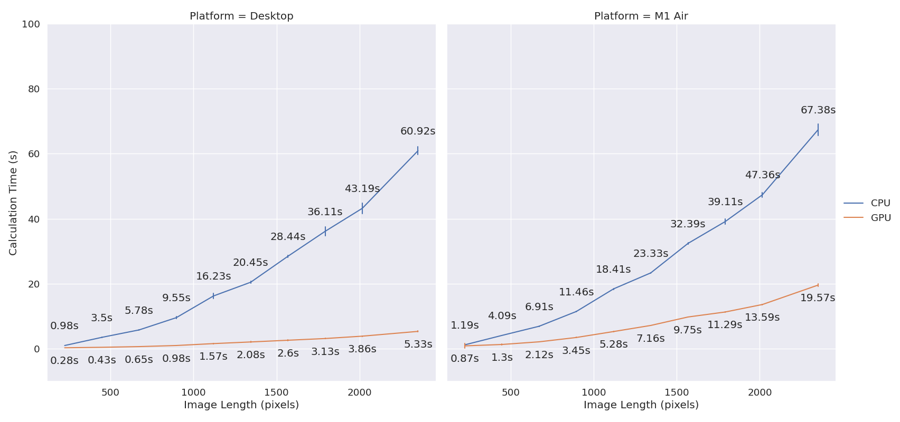
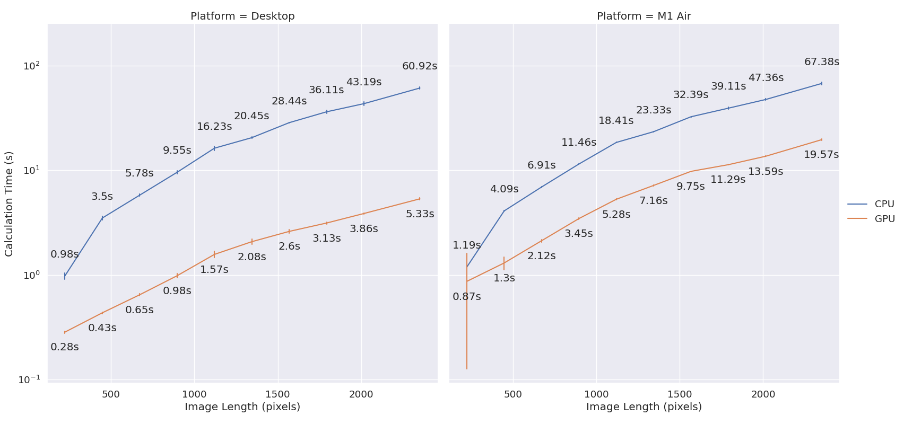
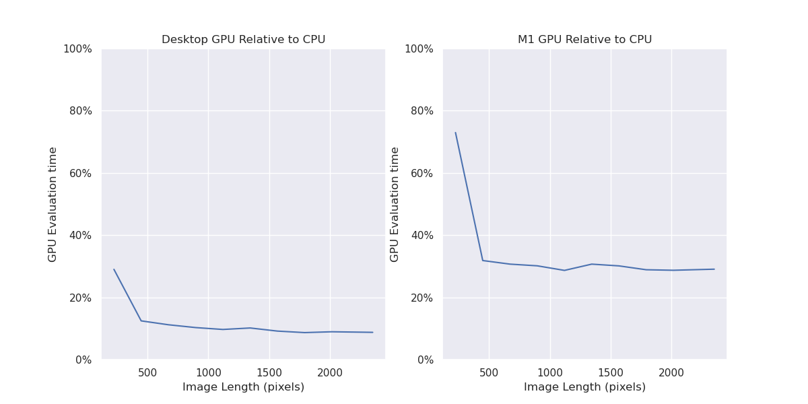
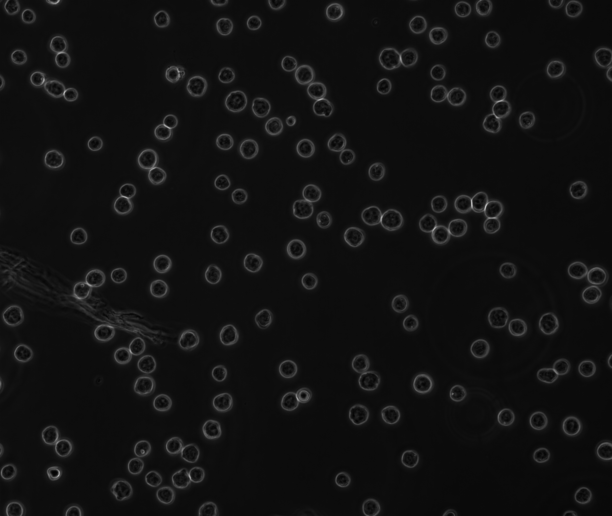

+++
title = 'Benchmarking Cellpose'
date = 2024-08-31T19:23:26-07:00
draft = false 
+++

## What is Cellpose?
[Cellpose](https://www.cellpose.org/) is a valuable tool in the arsenal of any bioimaging scientist. It allows for fast, accurate, and general segmentation of a variety of biological images. Cellpose uses a modified [UNet model](https://arxiv.org/abs/1505.04597), trained on a corpus of biological images, to determine the location and shape of cells.

However, image processing tasks can become quite long and computationally intensive, especially when tasks are processed serially on the CPU. In order to accelerate this process, it becomes worthwhile to leverage the GPU to accelerate processing. How much can a GPU really help? 

## GPU vs CPU &ndash; Speed Differences
[As of 2024](https://github.com/MouseLand/cellpose/commit/dc3848da80c671772fa5b6593867bbed784f95ac), Cellpose was enabled to work on Apple Silicon chips via their Metal GPU architecture. This now creates a competitor to NVIDIA's (CUDA) architecture. It's worthwhile to explore how much this speed-up means in terms of real-world performance. Here, I've taken a large square-ish image (~2100px^2), and have made a series of square crops of increasing lengths (outlined [below](#processing-details)). I then processed these images on a desktop featuring a NVIDIA RTX 4070, and compared it to my M1 Macbook Air.

## GPU Speed Increase is Logarithmic.
We can see that as image size increases, the improvement in speed is logarithmic. As the image increases, the GPU approaches a fixed relative speed improvement. This can be easily seen on a log scale.

This is incredibly useful for large images, as it means that the absolute gains in processing times will be larger as the images get bigger.

## The M1 GPU shows a strong performance increase

Here, I've compared a desktop with a dedicated GPU to a laptop, on a single image. It's expected the desktop will outperform the laptop. What's surprising is just how much of an improvement Metal has when it shifts to the GPU - roughly ~70% faster on every image (vs. ~90% on the Desktop.)

It's important to note that until 2024, Cellpose (and Torch more broadly) didn't officially support the Mac Metal GPU architecture, and therefore Cellpose was relegated to operate only on the CPU. Further, the M1 Air is their first iteration, and improvements should become more obvious and larger with more recent chips.

## Processing details:
All processing is done with the following setup from the python API:
- Cellpose v3.0.11
- Numpy v1.26.4
- Numba v0.60
- Torch/Pytorch 2.4.0
- Pytorch/CUDA 12.4 (For NVIDIA)

For the benchmark itself:
- I used diameter-estimation on every image
- I used the cyto3 model

For the Desktop, the processor is an Intel i7-8086K, 5GHz.

For these tests, I used 5 iterations per test, and recorded the mean +/- SD. Images increase in length and width in size, from the smallest (224px\*224px), to the full image (2560px\*2160px). The image comes from the 2022 NeurIPS challenge. This one is Cell\_00505.tif from the training images.

*Image from [2022 NeurIPS](https://zenodo.org/records/10719375) challenge, licensed CC-BY-ND*
